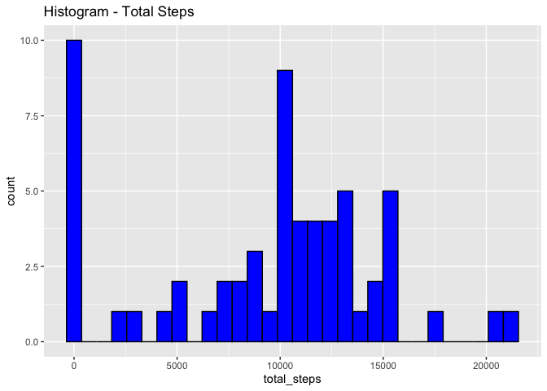
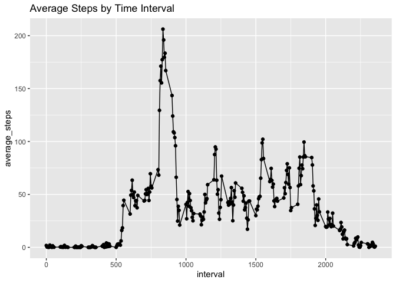
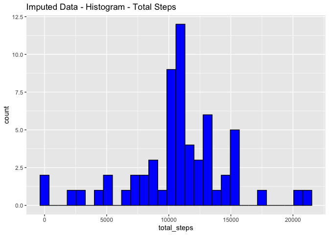
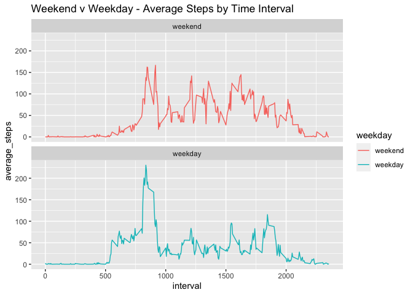

---


## Loading and preprocessing the data
### Import data *.csv file and format date column


```r
#required packages
library(data.table)
library(dplyr)
```

```
## 
## Attaching package: 'dplyr'
```

```
## The following objects are masked from 'package:data.table':
## 
##     between, first, last
```

```
## The following objects are masked from 'package:stats':
## 
##     filter, lag
```

```
## The following objects are masked from 'package:base':
## 
##     intersect, setdiff, setequal, union
```

```r
library(ggplot2)


#orginal data can be found:  https://d396qusza40orc.cloudfront.net/repdata%2Fdata%2Factivity.zip
unzip("activity.zip")
df <- fread("activity.csv")
# set data format
df$date <- as.Date(df$date, format="%Y-%m-%dæ")
```


##What is mean total number of steps taken per day?

```r
#summarise data by summing steps by day
totals <- df %>% group_by(date) %>% 
      summarise(total_steps=sum(steps, na.rm = TRUE))
```

```
## `summarise()` ungrouping output (override with `.groups` argument)
```

```r
# histogram plot of total steps by day
ggplot(totals, aes(x=total_steps)) + 
      geom_histogram(color="black", fill = "blue") +
      ggtitle("Histogram - Total Steps")
```

```
## `stat_bin()` using `bins = 30`. Pick better value with `binwidth`.
```

<!-- -->

```r
mean_steps <- mean(totals$total_steps)
median_steps <- median(totals$total_steps)
```

The mean total number of steps per day is 9354.2295082 and the median is 10395.


##What is the average daily activity pattern?

```r
#summarise data by interval accross all days, take average for each interval
intervals <- df %>% group_by(interval) %>% 
      summarise(average_steps=mean(steps, na.rm = TRUE))
```

```
## `summarise()` ungrouping output (override with `.groups` argument)
```

```r
# line plot of interval data
ggplot(intervals, aes(interval, average_steps)) + 
      geom_point() +
      geom_line() +
      ggtitle("Average Steps by Time Interval")
```

<!-- -->

```r
#find interval with the highest average steps
max_steps <- max(intervals$average_steps)
max_interval <- intervals$interval[intervals$average_steps==max_steps]
```

The 835 5 minute interval has the maximum number of steps (206.1698113)


##Imputing missing values


```r
#calculate total number of NA values
total_na <- sapply(df, function(x) sum(is.na(x)))
#duplicate dataframe
df_imputed <- data.frame(df)
#impute NA values with the mean of the interval across all time points
for (i in 1:nrow(df_imputed)){
      if(is.na(df_imputed$steps[i])){
            na_interval <- df_imputed$interval[i]
            df_imputed$steps[i] <- intervals$average_steps[intervals$interval==na_interval] 
      }
}
#summarise dataframe by date and sum the total number of steps per day
totals_imputed <- df_imputed  %>% group_by(date) %>% 
      summarise(total_steps=sum(steps, na.rm = TRUE))
```

```
## `summarise()` ungrouping output (override with `.groups` argument)
```

```r
#create histogram with total number of steps per day
ggplot(totals_imputed , aes(x=total_steps)) + 
      geom_histogram(color="black", fill = "blue") +
      ggtitle("Imputed Data - Histogram - Total Steps")
```

```
## `stat_bin()` using `bins = 30`. Pick better value with `binwidth`.
```

<!-- -->

```r
#calculate mean and meadian values for imputed data
mean_steps_imputed  <- mean(totals_imputed$total_steps)
median_steps_imputed  <- median(totals_imputed$total_steps)
```

After imputing NA values (#2304, 0, 0) with the mean of the interval: the mean total number of steps per day is 1.0766189\times 10^{4} and the median is 1.0766189\times 10^{4}.


##Are there differences in activity patterns between weekdays and weekends?


```r
#Create a new factor variable in the dataset with two levels – “weekday” and “weekend” indicating whether a given date is a weekday or weekend day.
weekday_names <- c("Monday", "Tuesday", "Wednesday", "Thursday", "Friday")

df_imputed$weekday <- factor((weekdays(df_imputed$date) %in% weekday_names), 
                   levels=c(FALSE, TRUE), labels=c('weekend', 'weekday')) 
#summarise based on interval and weekday using imputed data
intervals_imputed <- df_imputed %>% group_by(interval, weekday) %>% 
      summarise(average_steps=mean(steps, na.rm = TRUE))
```

```
## `summarise()` regrouping output by 'interval' (override with `.groups` argument)
```

```r
#create panel plot for weekday and weekend
ggplot(intervals_imputed, aes(x=interval, y=average_steps, group=weekday)) + 
      geom_line(aes(color=weekday)) + 
      facet_wrap(~ weekday, nrow=2) +
      ggtitle("Weekend v Weekday - Average Steps by Time Interval")
```

<!-- -->

It appears that activity starts later on the weekend with higher sustained activity!
